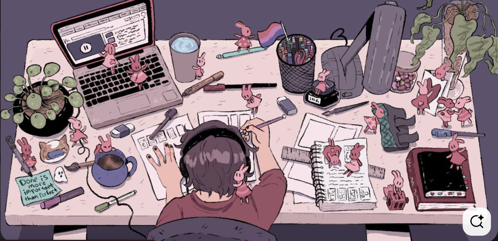

<h1 align="center">Hi 👋, I'm Yashita Puri</h1>
<h3 align="center">A passionate CSE (InfoSec) student, Web Developer & Tech Enthusiast from India</h3>

## 💫 About Me
- 🎓 B.Tech CSE (Information Security) @ VIT Vellore — **First Rank**, CGPA **9.83**
- 🛠️ Currently a **GSSoC '25 Contributor** and **Co-Secretary @ CodeChef-VIT**
- ⚔️ Experienced in cybersecurity: memory forensics, system hardening, and endpoint security
- 🌐 Skilled in **React**, **Next.js**, **Tailwind**, **TypeScript**, **Node.js**, **TensorFlow**, **OpenCV**
- 🧠 Exploring **Generative AI**, **Agentic Systems**, and **Fullstack Engineering**
- 🚀 Built 5+ projects and mentored 70+ juniors; co-hosted tech events with 1500+ participants
- 🥇 Amazon Hackathon Finalist | Created **CineAI**, an AI movie recommender
- 👯 Open to collaborating on **AI, frontend, and cybersecurity projects**
- 🥅 2025 Goals: Build impactful AI tools, contribute to open-source cybersecurity, and publish a research paper

<h4 align="center">"Code, Create, Secure – Repeat." 🚀</h4>

  

  
###

## 📊 GitHub Stats

  
  
  
  
  
  
  

 

# 🏆 GitHub Trophies

  

---

<h2 align="center">📚 My Tech Stack 📚</h2>

<h3 align="center">💻 MERN & Full-Stack</h3>

  

<h3 align="center">🎨 Frontend</h3> 

  

<h3 align="center">⚒️ Tools & Security</h3>

  

 

---

## 🌐 Connect with me  

  
  
  
  

---
### 

  
  

  <h3>⭐ Show some ❤️ by starring some of my repositories!</h3>

